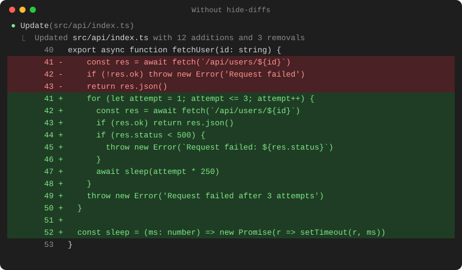
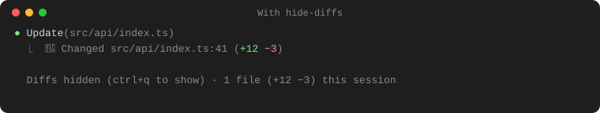
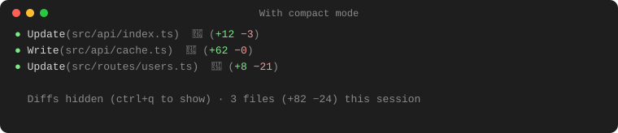
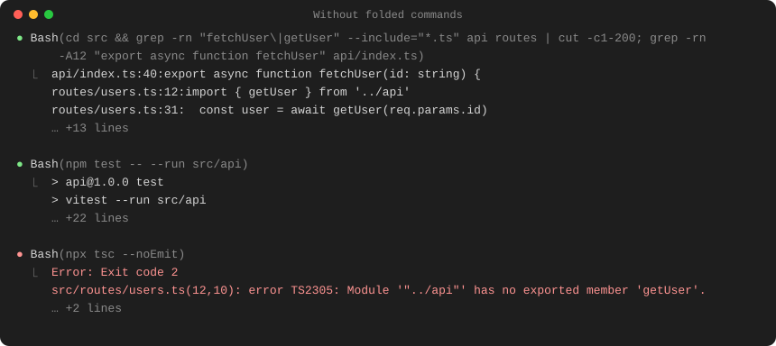
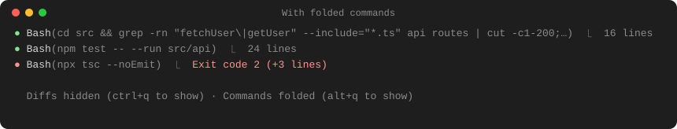

# hide-diffs

Tired of long diffs filling your Claude Code screen? This mod swaps them for a short summary:


Press **ctrl+q** any time to show the full diffs again.

It also folds each shell command to one line, `● Bash(npm test -- --run src/api)  ⎿  24 lines`. Press **alt+q** to show commands in full.

**Without hide-diffs**



**With hide-diffs**



**With compact mode** (turn it on in settings)



**Without folded commands**



**With folded commands** (alt+q switches them)



## What it does

- **Hides long diffs** from edits, new files, notebooks and shell commands, and shows the file, line and lines changed instead.
- **Easy to spot.** Every hidden diff starts with 🔶, so you can see at a glance where Claude changed something.
- **Keeps short diffs.** Changes of 5 lines or fewer still show in full.
- **Never hides what you need.** If Claude asks you to review an edit, you still see the whole diff.
- **Keeps count.** A small line above the prompt shows what's changed this session:
  `Diffs hidden (ctrl+q to show) · Commands folded (alt+q to show) · 14 files (+320 −85) this session`
- **Folds shell commands.** A finished Bash or PowerShell call takes one line: the command, cut to fit, then how many lines it printed (or its error in red, or what it changed in files). Press alt+q to show commands in full.
- **Compact mode.** Turn it on in settings to put the line counts right on the edit's own line, `● Update(src/api/index.ts)  🔶 (+12 −3)`, so each change takes one line.
- **Remembers your choice.** If you turn diffs back on, they stay on next time.

## Install

Works on Windows, macOS and Linux.

**1. Add the mod.** In Claude Code, type these two commands:

```
/plugin marketplace add gixxy22/hide-diffs
/plugin install hide-diffs@gixxy22-plugins
```

**2. Turn on the ctrl+q and alt+q shortcuts.** Open your keybindings file:

- Windows: `C:\Users\<you>\.claude\keybindings.json`
- macOS / Linux: `~/.claude/keybindings.json`

If the file doesn't exist, create it with this:

```json
{
  "bindings": [
    { "context": "Global", "bindings": { "ctrl+q": "settings:sortByTokens", "alt+q": "settings:periodWeek" } }
  ]
}
```

If it already exists, just add the `"ctrl+q": "settings:sortByTokens"` and `"alt+q": "settings:periodWeek"` lines inside your `Global` bindings.

> Why `settings:sortByTokens` and `settings:periodWeek`? A mod can only borrow a shortcut action that Claude Code isn't using at that moment. Those two are only used inside the `/usage` screen, so ctrl+q and alt+q always reach hide-diffs.

> Prefer a different key? Use any key you like in place of `ctrl+q`.

**3. Restart Claude Code.** That's it.

## Settings

Type `/config` and look for **hide-diffs**.

| Setting | Default | What it does |
| --- | --- | --- |
| Show small diffs | `5` | Diffs with this many changed lines or fewer still show in full. Set it to `0` to hide every diff. |
| Icon | `🔶` | Shown at the start of each hidden diff. Use any emoji or symbol, or leave it empty for none. |
| Compact mode | off | Puts the line counts on an edit's own line, like `● Write(src/a.ts)  🔶 (+12 −0)`, and drops the summary line under it. Shell commands and notebooks keep their summary line. |

## Update

Run these in a terminal, then restart Claude Code:

```sh
claude plugin marketplace update gixxy22-plugins
claude plugin update hide-diffs@gixxy22-plugins
```

## Uninstall

Run this in a terminal, then restart Claude Code:

```sh
claude plugin uninstall hide-diffs@gixxy22-plugins
```

## License

MIT
